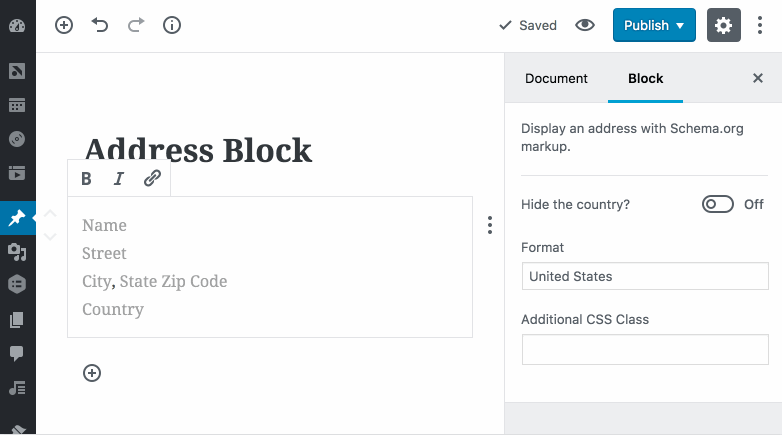

# WP Address Block

A Gutenberg block for displaying an address with Schema.org markup.



Entering the address in the image above produces the following markup:

```html
<div class="wp-block-cedaro-address vcard" itemscope itemtype="http://schema.org/PostalAddress">
	<span class="vcard__name" itemprop="name"><a href="https://wordpressfoundation.org/">WordPress Foundation</a></span><br>
	<span class="vcard__street" itemprop="streetAddress">660 4th Street<br>Box 119</span><br>
	<span class="vcard__city" itemprop="addressLocality">San Francisco</span>, <span class="vcard__state" itemprop="addressRegion">CA</span> <span class="vcard__postal-code" itemprop="postalCode">94107</span><br>
	<span class="vcard__country screen-reader-text" itemprop="addressCountry">United States</span>
</div>
```

## Installation

1. Download the [latest release](https://github.com/cedaro/wp-address-block/archive/develop.zip) from GitHub.
2. Go to the _Plugins &rarr; Add New_ screen in your WordPress admin panel.
3. Click the __Upload__ button at the top next to the "Add Plugins" title.
4. Upload the zipped archive.
5. Click the __Activate Plugin__ link after installation completes.
